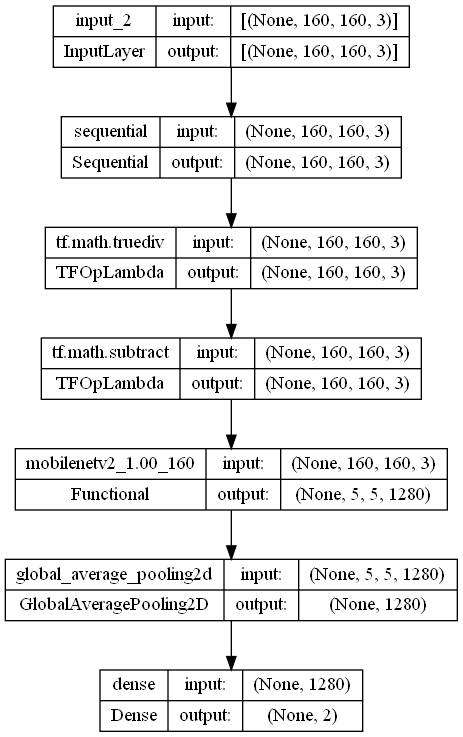
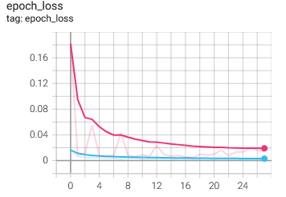
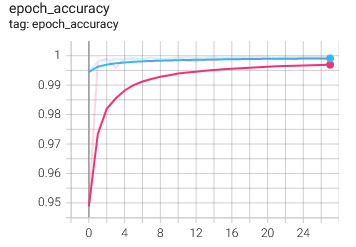
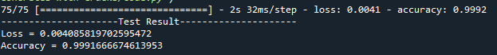
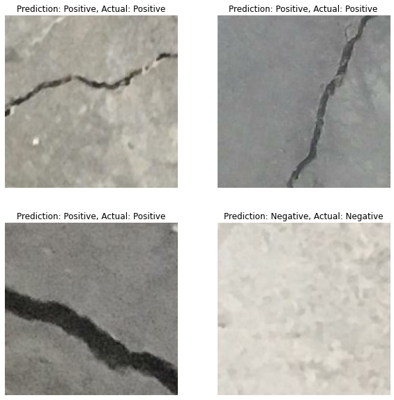

# Identifying Cracks on Concrete with Image Classification using Convolutional Neural Network

## Hardware Specifications
AMD Ryzen 7 3700x

NVIDIA Geforce RTX 3050

32GB 3200MHZ DDR4

## 1. Summary
The aim of the project is to create a convolutional neural network model that can identify cracks on concrete with a high accuracy. The problem is modelled as a binary classification problem (no cracks/negative and cracks/positive). The model is trained with a dataset of 40000 images (20000 images of concrete in good condition and 20000 images of concrete with cracks). The source of the dataset can be found [here](https://data.mendeley.com/datasets/5y9wdsg2zt/2).

## 2. IDE and Framework
The project is completed with Spyder 5.3.1 as the main IDE. The main frameworks used in this project are Numpy, Matplotlib and Tensorflow Keras.

## 3. Methodology
The methodology for this project is inspired by a documentation on the official TensorFlow website. You can refer to it [here](https://www.tensorflow.org/tutorials/images/transfer_learning).

### 3.1. Data Pipeline
The image data are loaded along with their corresponding labels. The data is first split into train-validation set, with a ratio of 70:30. The validation data is then further split into two portion to obtain some test data, with a ratio of 80:20. The overall train-validation-test split ratio is 70:24:6. No data augmentation is applied as the data size and variation are already sufficient.

### 3.2. Model Pipeline
The input layer is designed to receive coloured images with a dimension of 160x160. The full shape will be (160,160,3).

Transfer learning is applied for building the deep learning model of this project. Firstly, a preprocessing layer is created that will change the pixel values of input images to a range of -1 to 1. This layer serves as the feature scaler and it is also a requirement for the transfer learning model to output the correct signals.

For feature extractor, a pretrained model of MobileNet v2 is used. The model is readily available within TensorFlow Keras package, with ImageNet pretrained parameters. It is also frozen hence will not update during model training.

A global average pooling and dense layer are used as the classifier to output softmax signals. The softmax signals are used to identify the predicted class.

The simplified illustration of the model is shown in the figure below.

The model is trained with a batch size of 32 and 100 epochs. After training, the model reaches 99% training accuracy and 99% validation accuracy. The training results are shown in the figures below.

 

The graphs show a clear sign of convergence, indicating the model has been trained to reach an optimal level of accuracy and loss.

## 4. Results
The model is evaluated with the test data. The loss and accuracy are shown in figure below.

Some predictions are also been made with the model, and compared with the actual results.

